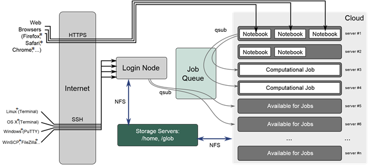
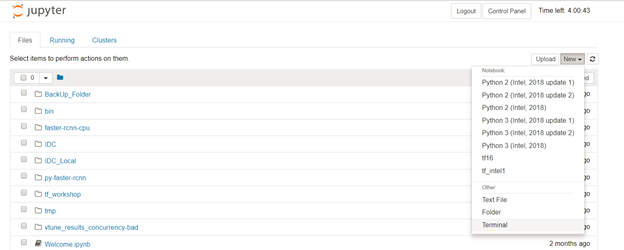

==========================
Frequently Asked Questions
==========================

General
=======

Review these high-level questions and answers to get started with the Intel AI DevCloud and AI.

How can I improve deep learning performance when my framework is running in the background?
~~~~~~~~~~~~~~~~~~~~~~~~~~~~~~~~~~~~~~~~~~~~~~~~~~~~~~~~~~~~~~~~~~~~~~~~~~~~~~~~~~~~~~~~~~~

In some situations, deep learning code with default settings does not take advantage of the full compute capability of the underlying machine on which it runs, especially when the code runs on Intel® Xeon® Scalable processors. Intel created optimization techniques that enable optimal CPU performance for popular frameworks like Caffe* and TensorFlow*. For more information, see `Tips to Improve Performance for Popular Deep Learning Frameworks on CPUs <https://software.intel.com/en-us/articles/tips-to-improve-performance-for-popular-deep-learning-frameworks-on-multi-core-cpus>`_.

Who can request access to the Intel AI DevCloud?
~~~~~~~~~~~~~~~~~~~~~~~~~~~~~~~~~~~~~~~~~~~~~~~~

Developers, data scientists, professors, students, start-ups, and others who are members of Intel® AI Academy are eligible to request access.

How do I become a member of the Intel® AI Academy?
~~~~~~~~~~~~~~~~~~~~~~~~~~~~~~~~~~~~~~~~~~~~~~~~~~

You can join the AI Academy by requesting access to the DevCloud `here
<https://software.intel.com/en-us/ai-academy/devcloud>`_. or you can become a member by `registering
<https://software.intel.com/en-us/ai/sign-up>`_. 

What happens once I have received access?
~~~~~~~~~~~~~~~~~~~~~~~~~~~~~~~~~~~~~~~~~

Once you gain access, you will log on to a Linux*-based head node of a batch farm. There, you can stage your code and data, compile it, and then submit jobs to a queue. Once the queued job completes, your results will be in your home ($HOME) directory.

- Jobs are scheduled on Intel® Xeon® Scalable processors.
- Each processor has 24 cores with two-way hyperthreading.
- Each processor has access to 96 GB of on-platform RAM (DDR4).
- Only one job will run on any processor at a time.
- You will get 200 GB of file storage quota.
- Your home directory is not visible to other users.

.. Note:: Once your access period expires, your home directory on the cluster will be deleted.

I don’t live in the United States. Can I still get access to the Intel AI DevCloud?
~~~~~~~~~~~~~~~~~~~~~~~~~~~~~~~~~~~~~~~~~~~~~~~~~~~~~~~~~~~~~~~~~~~~~~~~~~~~~~~~~~~

The Intel AI DevCloud is available to all members of the Intel AI Academy, and is accessible from any country.

How much do I have to pay to use the Intel AI DevCloud?
~~~~~~~~~~~~~~~~~~~~~~~~~~~~~~~~~~~~~~~~~~~~~~~~~~~~~~~

Nothing. It is free to the members of `Intel® AI Academy. <https://software.intel.com/en-us/ai-academy>`_  To `join <https://software.intel.com/en-us/ai/sign-up>`_  the AI Academy is also free.

Is CUDA* installed on the Intel AI DevCloud?
~~~~~~~~~~~~~~~~~~~~~~~~~~~~~~~~~~~~~~~~~~~~

No. The Intel AI DevCloud consists of high-performing Intel® Xeon® Gold 6128 processors but does not include CUDA*.

Why do I get permission denied when I try to run a pip install <Package_Name>?
~~~~~~~~~~~~~~~~~~~~~~~~~~~~~~~~~~~~~~~~~~~~~~~~~~~~~~~~~~~~~~~~~~~~~~~~~~~~~~

To install a package using the default Python* format, use the following with pip:

--user parameter

>>> pip install numpy --user

The other option is to create a new Conda* environment, activate it, and then perform the pip* or Conda installations in that environment. Multiple versions of the same package in the default Python format can create problems. To avoid these problems, create separate Conda environments for each activity.

Executing Jobs
==============

To help developers execute jobs on the Intel AI DevCloud, type the following answers into the command line in Linux*.

How do I check whether I’m on login node or compute node?
~~~~~~~~~~~~~~~~~~~~~~~~~~~~~~~~~~~~~~~~~~~~~~~~~~~~~~~~~

Check the prompt of your terminal.

If it shows [uxxxx@c009 ~]$, you are on the login node.

If it shows something like [uxxxx@c009-n0xx ~]$, you are on the compute node.

How do I check the logs of my running job?
~~~~~~~~~~~~~~~~~~~~~~~~~~~~~~~~~~~~~~~~~~
You can check the logs of your running job as follows:
For output logs, use qpeek:

>>> qpeek -o <JOB_ID>

For error logs:

>>> qpeek -e <JOB_ID>

How do I check the logs of my completed job?
~~~~~~~~~~~~~~~~~~~~~~~~~~~~~~~~~~~~~~~~~~~~

Check your completed job logs as follows:
 
- If you gave a name when submitting a job using qsub, the log files will be <JOB_NAME>.o<JOB_ID> and <JOB_NAME>.e<JOB_ID>
- If you did not give a name and you submitted a job as qsub <JOB_SCRIPT>, the log files are <JOB_SCRIPT>.o<JOB_ID> and <JOB_SCRIPT>.e<JOB_ID>
- If you did not give a name and you submitted a job as <COMMAND> | qsub, the log files are STDIN.o<JOB_ID> and STDIN.e<JOB_ID>

How do I set total wall clock time to the maximum on the Intel AI DevCloud?
~~~~~~~~~~~~~~~~~~~~~~~~~~~~~~~~~~~~~~~~~~~~~~~~~~~~~~~~~~~~~~~~~~~~~~~~~~~

In the command line, type one of the following:

>>> echo python <sample.py> -l walltime=24:00:00 | qsub

Add wall time in bash script before running in qsub mode:

>>> !/bin/sh#PBS -l walltime=24:00:00 python sample.py

How do I query a job?
~~~~~~~~~~~~~~~~~~~~~

In the command line, type:

>>> qpeek -o <JOBID>

If this doesn't return any results, it is possible that the job is complete and qpeek did not get a chance to peek.

Alternatively run qsub with the "-k oe" option:

>>> qsub -k oe my_script

Standard input/output and error will be dumped into your home directory. You can check at any time while jobs are running.

How do I increase the wall clock time?
~~~~~~~~~~~~~~~~~~~~~~~~~~~~~~~~~~~~~~

In the command line, type one of the following:

>>> PBS -l walltime=<10:30>,mem=320kb

>>> echo sleep 1000 | qsub -l walltime=<00:30:00>

How do I get the full information about a job?
~~~~~~~~~~~~~~~~~~~~~~~~~~~~~~~~~~~~~~~~~~~~~~

In the command line, type:
>>> qstat -f <JOBID>

How do I delete a job?
~~~~~~~~~~~~~~~~~~~~~~

In the command line, type:

>>> qdel <JOBID>

How do I find the architecture and features of the compute nodes available to me?
~~~~~~~~~~~~~~~~~~~~~~~~~~~~~~~~~~~~~~~~~~~~~~~~~~~~~~~~~~~~~~~~~~~~~~~~~~~~~~~~~

Run the following command in the login node:

>>> pbsnodes

How do I log in to a compute node?
~~~~~~~~~~~~~~~~~~~~~~~~~~~~~~~~~~

In the command line, type:

>>> qsub –I

How do I get details of the nodes?
~~~~~~~~~~~~~~~~~~~~~~~~~~~~~~~~~~

In the command line, type:

>>> pbsnodes -a

Why do I get a memory error while running commands?
~~~~~~~~~~~~~~~~~~~~~~~~~~~~~~~~~~~~~~~~~~~~~~~~~~~

In most cases, memory error is caused by trying to run compute-intensive tasks on the login node. In such cases, log in to the compute node using qsub –I and execute your commands there.

My job takes more than 24 hours to run, but the Intel® AI DevCloud has a maximum wall clock time of 24 hours. How do I run my job in this case?
~~~~~~~~~~~~~~~~~~~~~~~~~~~~~~~~~~~~~~~~~~~~~~~~~~~~~~~~~~~~~~~~~~~~~~~~~~~~~~~~~~~~~~~~~~~~~~~~~~~~~~~~~~~~~~~~~~~~~~~~~~~~~~~~~~~~~~~~~~~~~~~

The maximum wall clock time is set to 24 hours to ensure fair utilization of cluster resources by all. However, some workarounds are provided:
 
- Save the model at regular intervals or at least once before the wall time expires. At the end of 24 hours, submit a new job that will load the last saved model, and then start training from there.

By saving the model at regular intervals, your additional benefits include getting copies of your trained model early and evaluating the model on test data. This also helps to understand how the model is performing and to make any changes early enough instead of waiting for a long job to complete.
 
Your code may not be fully using the compute resources. For popular frameworks TensorFlow* and Caffe*, see `Optimization Tips for Popular Deep Learning Frameworks <https://communities.intel.com/docs/DOC-112392>`_.

Login Node versus Compute Node
==============================

What is the difference between login node and compute node?
~~~~~~~~~~~~~~~~~~~~~~~~~~~~~~~~~~~~~~~~~~~~~~~~~~~~~~~~~~~

Login node uses a lightweight general purpose processor. Compute node uses an Intel® Xeon® Gold 6128 processor that is capable of handling heavy workloads. All of the tasks that need extensive memory and compute resources have to be run on compute node not on login node.

How are the login and compute nodes placed on the Intel® AI DevCloud?
~~~~~~~~~~~~~~~~~~~~~~~~~~~~~~~~~~~~~~~~~~~~~~~~~~~~~~~~~~~~~~~~~~~~~

The following diagram illustrates the overall architecture of Intel® AI DevCloud:

Why can’t I run compute-intensive tasks on the login node?
~~~~~~~~~~~~~~~~~~~~~~~~~~~~~~~~~~~~~~~~~~~~~~~~~~~~~~~~~~

Login node is lightweight and not capable of handling heavy workloads. It is primarily intended to save your data; hence, a limit is enforced on both memory and compute on login nodes. This ensures that a memory error is thrown if you try to run any heavy tasks on the login node.

How do I check to see whether I’m on login node or compute node?
~~~~~~~~~~~~~~~~~~~~~~~~~~~~~~~~~~~~~~~~~~~~~~~~~~~~~~~~~~~~~~~~

You are on the compute node if the prompt shows n0xx:

>>> [u556@c009-n014 ~]$ 

If the prompt does not display n0xx, you are on the login node, as illustrated in the following image:

>>> [u556@c009 ~]$ 

How do I run compute-intensive jobs?
~~~~~~~~~~~~~~~~~~~~~~~~~~~~~~~~~~~~

You can run jobs on the compute node with any of the following options:
 
- Submit a job using qsub <JOB_SCRIPT>from the login node. The job waits in the queue until the scheduler picks it up and finally runs it on the compute node.
- Run the job in interactive mode using qsub –I. This creates a job with default settings and provides you with a terminal from the compute node. You can directly run the commands there.
- Use JupyterHub*. To do this, navigate to Colfax Research. Sign in, and then and start the server. Create a new notebook and run the code from there.
- Use qsub from JupyterHub. To do this, navigate to Colfax Research. Log in, and then and start the server. Create a new notebook. Submit the job using the qsub command. Details are available in the Welcome.ipynb file in the home folder of Intel AI DevCloud.
- Directly run from JupyterHub terminal. To do this, navigate to Colfax Research. Log in, and then and start the server. Start a new terminal, which is a compute node where you can directly run the commands of a compute-intensive job in the terminal. (For more details on starting a new terminal, see JupyterHub Terminal Versus SSH Terminal).
- Using qsub from the JupyterHub terminal. To do this, submit the job using “qsub <JOB_SCRIPT>” from the JupyterHub terminal. This submits the job, and the job waits in the queue until the scheduler picks it up and executes it on compute node.

What is the difference between batch qsub mode and interactive qsub mode for job submission?
~~~~~~~~~~~~~~~~~~~~~~~~~~~~~~~~~~~~~~~~~~~~~~~~~~~~~~~~~~~~~~~~~~~~~~~~~~~~~~~~~~~~~~~~~~~~

In batch qsub mode, jobs are created and submitted using the command “qsub <JOB_SCRIPT>” from the login node. <JOB_SCRIPT> contains the job commands.

In interactive qsub mode, a job is created using the command “qsub –I”.

After executing this command you get a new terminal from the compute node allocated for your job. You can then run job commands directly in the terminal.

How do I enter interactive qsub mode?
~~~~~~~~~~~~~~~~~~~~~~~~~~~~~~~~~~~~~

When using SSH (secure shell) to access the Intel AI DevCloud with a PuTTY*/Linux* terminal, enter the login node first. To run a job in interactive qsub mode, type qsub –I. This creates a new job and provides a terminal from the compute node allocated for this job. 

--code:: bash

	[u14092@c009 ~]$ qsub -I
	qsub: waiting for job 195250.c009 to start
	qsub: job 195250.c009 ready

	########################################################################
	#      Date:           Thu Nov 15 15:12:07 PST 2018
	#    Job ID:           195250.c009
	#      User:           u14092
	# Resources:           neednodes=1:ppn=2,nodes=1:ppn=2,vmem=92gb,walltime=06:00:00
	########################################################################

	[u14092@c009-n024 ~]$ 

When should I use batch qsub mode and when should I use interactive qsub mode?
~~~~~~~~~~~~~~~~~~~~~~~~~~~~~~~~~~~~~~~~~~~~~~~~~~~~~~~~~~~~~~~~~~~~~~~~~~~~~~

Use batch qsub mode when you have a tested running code and need to run it and store the results.

Use interactive qsub mode when you are still in the process of creating a running code and expect errors.

You can fix them simultaneously, just as if you were doing it on a local machine.

How do I check job status and logs in qsub mode versus interactive qsub mode?
~~~~~~~~~~~~~~~~~~~~~~~~~~~~~~~~~~~~~~~~~~~~~~~~~~~~~~~~~~~~~~~~~~~~~~~~~~~~~

In qsub mode, you can submit the job, work on other things, and then come back later to check for updates. Check your job status with the qstat command, and check logs using the log file/qpeek command.

In interactive qsub mode, once the terminal has expired, the logs written while the job or command was running are deleted.

Adjust GPU-Specific Configurations for a CPU
============================================

Can I run TensorFlow* with graphics processing unit (GPU) support on the Intel® AI DevCloud?
~~~~~~~~~~~~~~~~~~~~~~~~~~~~~~~~~~~~~~~~~~~~~~~~~~~~~~~~~~~~~~~~~~~~~~~~~~~~~~~~~~~~~~~~~~~~

The Intel® AI DevCloud is a cluster of Intel® Xeon® Scalable processor high-performance CPUs. We need to make sure that code written for a GPU-specific environment is converted to make the execution possible with CPUs.

How do I convert GPU-specific configurations for a CPU?
~~~~~~~~~~~~~~~~~~~~~~~~~~~~~~~~~~~~~~~~~~~~~~~~~~~~~~~

You can do this in one of two ways:
 
- While building the framework, change the configuration settings from GPU to CPU
- Comment or change the code snippets that are written specifically for GPUs.

How do I change the code snippet from GPU to CPU in the deep learning frameworks?
~~~~~~~~~~~~~~~~~~~~~~~~~~~~~~~~~~~~~~~~~~~~~~~~~~~~~~~~~~~~~~~~~~~~~~~~~~~~~~~~~
For C++:

Remove the following lines of code in the file detection_loss_layer.cpp (folder: src/caffe/layers):
.. code :: bash

	#ifdef CPU_ONLY STUB_GPU(DetectionLossLayer); #endif

For PyTorch*:

Remove the occurrences of .cuda to switch from a GPU to a CPU.

For example:

.. code :: python

	if torch.cuda.available():

		import torch.cuda

	else:

		import torch

To comment or change the code snippets that are written specifically for GPUs, see some of the examples on GitHub for Caffe*-Yolo*.

What are the configuration changes that I need to set while building Caffe* in CPU mode?
~~~~~~~~~~~~~~~~~~~~~~~~~~~~~~~~~~~~~~~~~~~~~~~~~~~~~~~~~~~~~~~~~~~~~~~~~~~~~~~~~~~~~~~~

Clone the Intel® Optimization for Caffe* from GitHub*.
Make the following configuration changes to build Caffe on the CPU:

.. code :: bash

	CPU_ONLY: = 1 # in Makefile.configuration

	solver_mode: CPU # in solver.prototxt

The Intel AI DevCloud has the CPU version of Faster R-CNN also available with the latest version of Intel Optimization for Caffe.

How do I install TensorFlow* in CPU mode?
~~~~~~~~~~~~~~~~~~~~~~~~~~~~~~~~~~~~~~~~~

For details, refer to the TensorFlow* installation guide.

To install, see Intel® Optimization for TensorFlow* (CPU only) through PIP*, conda*, or from source.

How do I install PyTorch* in CPU mode?
~~~~~~~~~~~~~~~~~~~~~~~~~~~~~~~~~~~~~~

Go to PyTorch, and then select the criteria that matches your environment, which includes CUDA=None, and then run the corresponding command. For example:

1. When using conda on the CPU, use this command:

>>> conda install pytorch-cpu torchvision-cpu -c pytorch 

2. When using PIP on the CPU, do the following:

>>> pip install --user http://download.pytorch.org/whl/cpu/torch-0.4.0-cp27-cp27mu-linux_x86_64.whl%20

>>> pip install --user torchvision

If the above install does not work, as Python* 2.7 UCS2 is already installed, use this command:

>>> pip install --user http://download.pytorch.org/whl/cpu/torch-0.4.0-cp27-cp27m-linux_x86_64.whl

How do I change the configuration when building Apache MXNet* in CPU mode?
~~~~~~~~~~~~~~~~~~~~~~~~~~~~~~~~~~~~~~~~~~~~~~~~~~~~~~~~~~~~~~~~~~~~~~~~~~

Clone the source code for Apache MXNet*: 

>>> git clone https://github.com/apache/incubator-mxnet.git

Set the following fields in make/config.mk to build Apache MXNet on the CPU:

.. code :: bash

	USE_CUDA = 0
	USE_CUDA_PATH = NONE
	USE_CUDNN = 0

After installing it, you need to edit some lines of code that are specific to the GPU. For example, in the speech recognition use case in the folder path incubator-mxnet/example.speech_recognition:

1) Remove the following line in main.py:

.. code :: python

	os.environ['MXNET_ENABLE_GPU_P2P'] = "0"

2) Change the line below in deepspeech.cfg:

.. code :: bash

	context = gpu0,gpu1,gpu2

Change to:

.. code :: bash

	context = cpu0,cpu1,cpu2

How do I install Keras in CPU mode?
~~~~~~~~~~~~~~~~~~~~~~~~~~~~~~~~~~~

Keras can be installed in CPU mode by using backend as TensorFlow-CPU or Theano-CPU.

The command to install Keras is:

>>> pip install keras

>>> cd .keras

Specify the backend in the file keras.json:

.. code :: bash

	{

	"image_data_format": "channels_last",

	"epsilon": 1e-07,

	"floatx": "float32",

	"backend": "tensorflow” }

For further information, see `Keras documentation on backends <https://keras.io/backend/>`_.

JupyterHub* Terminal versus SSH Terminal
========================================

How do I log in to the JupyterHub* terminal?
~~~~~~~~~~~~~~~~~~~~~~~~~~~~~~~~~~~~~~~~~~~~

Go to Colfax Research.
Enter your user ID and password in the Login page. Your user ID is available in the Intel® AI DevCloud welcome email. The password is the unique user ID (UUID) also included in the welcome email.
The image below shows the home directory contents that are displayed after signing in.

To open a new terminal, in the right corner, select New, and then select Terminal. The Jupyter Notebook* terminal appears on the compute node. Jupyter notebook terminal on compute node

How do I log in to the SSH terminal?
~~~~~~~~~~~~~~~~~~~~~~~~~~~~~~~~~~~~

Follow the instructions in the Intel AI DevCloud welcome email link.

(https://access.colfaxresearch.com/?uuid=xxxxxxx-xxxx-xxxx-xxxx-xxxxxxxx). If the sign in is successful, a SSH terminal appears.

What is the difference between a JupyterHub terminal and an SSH terminal?
~~~~~~~~~~~~~~~~~~~~~~~~~~~~~~~~~~~~~~~~~~~~~~~~~~~~~~~~~~~~~~~~~~~~~~~~~

The differences are:

1. Execution time

A JupyterHub* terminal has a maximum session time of four hours. After that time, the session is terminated without leaving a log.

An SSH terminal gives a default wall clock time of six hours for jobs submitted using qsub. These default settings can be altered to provide a maximum of 24 hours wall clock time.

2. Job logs

A JupyterHub terminal does not currently provide a qpeek tool, which is used to get near real-time job logs. Also, job logs may not be properly written due to session expiry.

An SSH terminal does provide a qpeek tool. You can check near real-time job logs of a running job with qpeek –o <JOB_ID> (output logs) and qpeek –e <JOB_ID> (error logs).

3. Logged-in terminal

The JupyterHub terminal signs in to the compute node directly .

The SSH terminal signs in to the login node directly. Enter qsub –I to go to the compute node.

I submitted a job through a JupyterHub terminal. Why can’t I see the job logs?
~~~~~~~~~~~~~~~~~~~~~~~~~~~~~~~~~~~~~~~~~~~~~~~~~~~~~~~~~~~~~~~~~~~~~~~~~~~~~~

A JupyterHub session expires at the end of four hours. Remaining time is displayed in the top right of the session page. Jobs longer than four hours are stopped at the end of the session time and logs are not properly written. For jobs longer than four hours, use qsub mode with a PuTTY or Linux SSH terminal. In these cases, we suggest you use qsub mode with a PuTTY* or Linux* SSH terminal.

